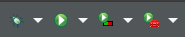
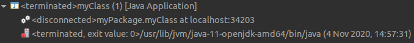
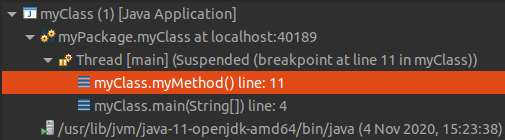

# Algorithms 101 - How to Research Algorithms (WORK IN PROGRESS NOT COMPLETE)

## Three useful tools for researching Algorithm

### Content

1.  How to print an array to console
2.  How to measure the runtime of an algorithm
3.  How to write data to file
4.  Debugging Java Code in Eclipse

## How to print an array to console

If you were to run the following code into Eclipse:

```java
public class myClass {
	static int[] myObj = {1, 3984, 394, 394, 49, 763};
	public static void main(String[] args) {
		myMethod(myObj);
	}
	private static void myMethod(int[] myObj) {
		System.out.println(myObj);
	}
}
```

You will get the following output or something similar:

```
[I@d716361
```

This is because an array is a linear data structure which means it's not intended for printing out. So how do we print an array?

To print an array, we need to do the following.

1. First and foremost, we need to get each element of the array in order. To do this we will use a For Loop.

```Java
for (int index = 0; i < n; ++i) {
    // Code Goes Here
}
```

2. Once we have an element from the array we can print it. You cannot print an array, but you an print the element inside an array. To do this we will use System.out.print.

```Java
System.out.print(); // Prints Object to current line
System.out.println(); // Prints Object to new line.
```

#### The Final Code

```java
public class myClass {
	static int[] myObj = {1, 3984, 394, 394, 49, 763};
	public static void main(String[] args) {
		myMethod(myObj);
	}
	private static void myMethod(int[] myObj) {
		int n = myObj.length;
		for (int i = 0; i < n; ++i) {
			System.out.print(myObj[i] + ", ");
		}
	}
}
```

### The Result

```
1, 3984, 394, 394, 49, 763, 
```

## How to record the runtime of a Method

Recording the runtime of a Method is very straighforward. In java there are multiple methods which can record the current time. 

1.  Current Time Millis (`currentTimeMillis`)
    
    - Returns the current time in Milliseconds since the Unix Epoch (January 1, 1970)

2. Nano Time (`nanoTime()`)

    - Returns the elapsed runtime in of the Java Virtual Machine in Nanoseconds.

To record the runtime of an algorithm, you must first recored the time you start the algorithm. After the algorithm has completed it's task, you record the time after. Once you have the `before` and `after` times, you can calculate the elapsed time which is `after - before = elapsed`.

### Current Time Millis
```java
long before = System.currentTimeMillis();
veryComplexAlgorithm();
long after = System.currentTimeMillis();
System.out.println(before - after + "ms")
```

### Nano Time
```java
long before = System.nanoTime();
veryComplexAlgorithm();
long after = System.nanoTime();
System.out.println(before - after + "ns")
```

### Which should you use?
Current Time Millis is a reliable method for recording runtime but algorithms may run too fast for Current Time Millis to handle. Nano Time is more reliable for faster algoritms.

## How to write data to a file

Sometimes you may want to write to a file when experimenting with datasets. For example, you may want to record the Current Iteration and Fitness of a solution in a Hill Climbing algorithm to measure how quickly the algorithm reaches a convergent plain.

### How to make a file
```java
import java.io.File;  // Import the File class
import java.io.IOException;  // Import the IOException class to handle errors

public class myClass
    public static void main(String[] args) {
        myMethod();
    }
    private static void myMethod() {
        try {
            File myObj = new File("filename.txt");
            if (myObj.createNewFile()) {
                System.out.println("File created: " + myObj.getName());
            } else {
                System.out.println("File already exists.");
            }
            } catch (IOException e) {
                System.out.println("An error occurred.");
                e.printStackTrace();
            }
        }
    }
}
```

### How to write a file
```java
import java.io.FileWriter;   // Import the FileWriter class
import java.io.IOException;  // Import the IOException class to handle errors

public class myClass
    public static void main(String[] args) {
        myMethod();
    }
    private static void myMethod() {
        try {
            FileWriter myWriter = new FileWriter("filename.txt");
            myWriter.write("Files in Java might be tricky, but it is fun enough!");
            myWriter.close();ls
            System.out.println("Successfully wrote to the file.");
        } catch (IOException e) {
            System.out.println("An error occurred.");
            e.printStackTrace();
        }
    }
}
```

## Debugging Java Code in Eclipse

Regardless of how complex an algorithm is, everybody makes mistakes when writing code. Whether it be a simple typo, wrong data type or more, it is good practice to learn how to debug code when it goes wrong. This paragraph covers the following:

1.  How to use the Debug Tools in Eclipse
2.  How to use Logging in Java

### How to use the Debug Tools in Eclipse

#### How to enter the Debug Mode

When you run your code in Elipse, you press the green button with a right facing white arrow.



To run an application in Debug Mode, press the white down facing arrow next to the green bug, press Run As, and select Java Application. This will bring up a pop-up similar to the image below asking you to switch perspectives to Debug Mode:


There are 3 important compontents to Eclipse Debug Mode.

##### Debug Perspective



The first component is the Perspective, when you run a class for the first time, you will see nothing aside from the image above. To view more content, you need to use Break Points. Break Points are a feature in most IDE's where you can stop the code at a specific point during it's run to record current values. Take for example the following code, if we put a Break Point on line 11, we will be able to see the current values of `i`, `j`, and `val`. We will also start seeing more information in the Debug Perspective of where the Break Points are, and what method they are in, and where the method is called. 

```java
package myPackage;
public class myClass {
	public static void main(String[] args) {
		myMethod();
	}
	public static void myMethod() {
		int val = 0;
		for (int i = 0; i < 10; ++i) {
			val++;
			for (int j = 0; j < 10; ++j) {
				val++;
			}
		}
		System.out.println(val);
	}
}
```


